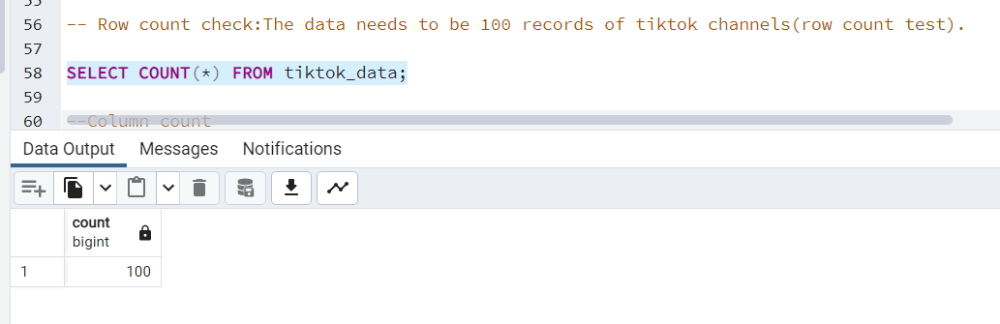
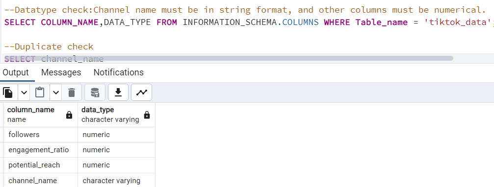
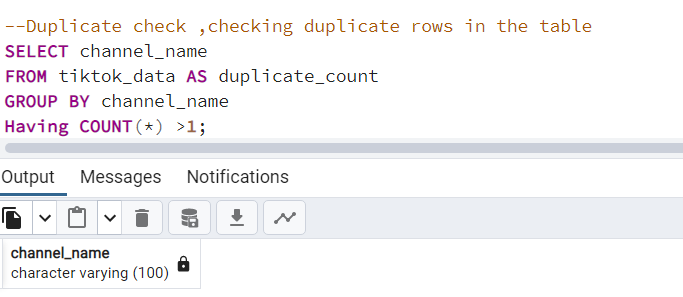
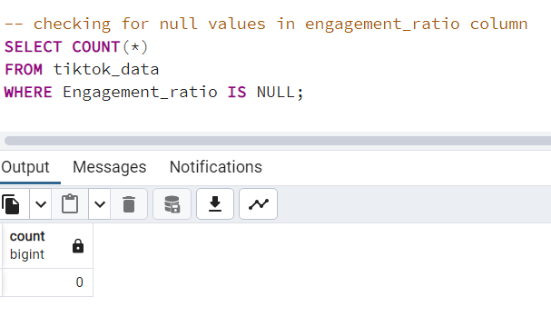
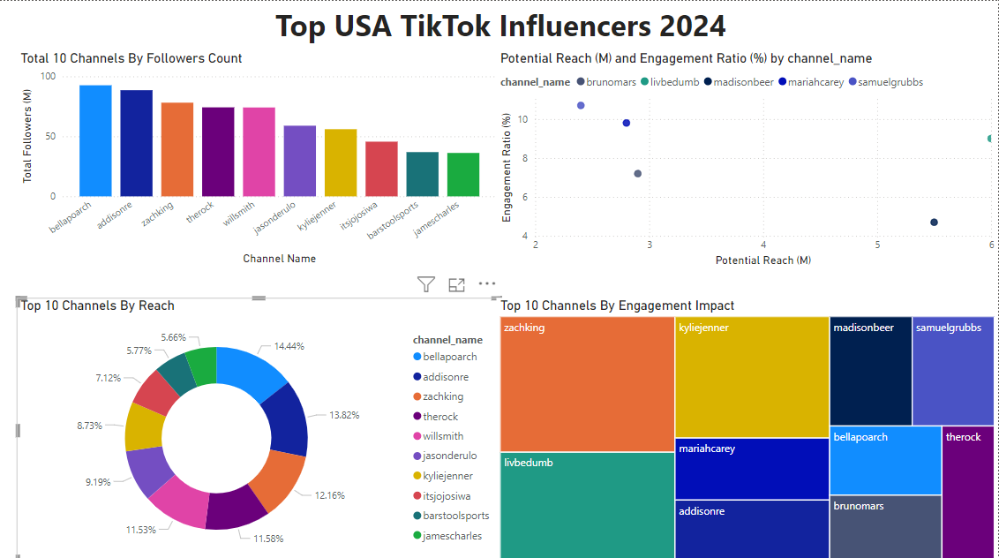
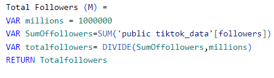
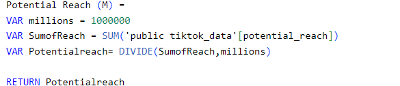
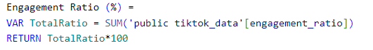
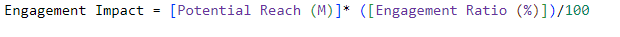

# Data Portfolio : Excel to Power BI


# Table of Contents

- [Objective](#objective)
- [Data Source](Data-source)
- [Tools](#Tools)
- [Steps](#Steps)
	- [Data Exploration](#Data-Exploration)
	- [Data Cleaning](#Data-Cleaning)
	- [Data Transformation](#Data-Transformation)
- [Testing](#Testing)
- [Visualizations](#Visualizations)
- [Findings](#Findings)
- [Conclusion](#Conclusion)
  
 
# Objective 
 
 The Head of Marketing seeks to identify the leading TikTok Influencers in 2024 to determine which influencers would be the most effective partners for marketing campaigns for the remainder of the year.
 The goal is to pinpoint influencers with the highest potential to drive engagement and reach.
 

# Solution
 
 To develop a dashboard that provides insights into the leading USA TikTok Influencers in 2024 that includes:
 - Followers Count
 - Potential Reach 
 - Engagement Impact

# Data Source

The data is sourced from Kaggle,[Click here to find it.](https://www.kaggle.com/datasets/bhavyadhingra00020/top-100-social-media-influencers-2024-countrywise?resource=download)

# Tools

| Tool	     |  Purpose                                   |
|---------   |---------------------------------------------|
| Excel      |  Exploring the data                         |
| SQL	     |  Cleaning, testing, and analyzing the data  |
| Power BI   |  Visualizing the data                       |
| GitHub     |  Hosting the Project documentation          |


# Steps

1. Get the dataset
2. Data Exploration in Excel
3. Import the data into SQL Server
4. Clean data in SQL
5. Validate the data integrity with SQL
6. Create visualizations in Power BI
7. Analyze and Interpret findings based on the insights
8. Documentation
9. Publish the project on GitHub Pages

# Data Exploration 

## Initial Observation:

- There are 4 columns that provide the necessary data we need.
- The first column has the influencers name and channel name separated by @ symbol. We need to extract the influencers channel name.
- The ER column contains null values. We will be using group mean imputation to fill in the missing data.
- The dataset contains additional columns beyond what we need, so certain columns should be removed.

# Data Cleaning
The aim is to transform our dataset and make it ready for analysis by implementing the following steps:

1. Remove unnecessary columns by only selecting the ones we need.
2. Extract TikTok account names from the name column.
3. Ensure all columns are correctly formatted (numeric values for followers, ER, and potential reach).
4. Handle any missing or inconsistent data (blank engagement rate).
5. Check for duplicates 

# Data Transformation 

Categorized TikTok influencers into Low, Mid, and High based on their followers count to address missing Engagement Ratio values by imputing them with the average Engagement_ratio for each category.
By grouping influencers into these categories, I calculated the mean Engagement_ratio for each group and used these values to fill in missing data. This approach ensures that influencers with missing ER values are assigned representative rates according to their follower size, thereby preserving the integrity of the data and providing a more accurate basis for analysis. 


```sql 
/* 
Select required column
extract the channel name from name column and cast the extracted column into VARCHAR(100).
Cast followers,ER Potential_Reach column into numerical format.
Created a table named TikTok data to store the transformed data.
*/

CREATE Table tiktok_data AS 
SELECT	CAST(TRIM(split_part(Name,'@',2)) AS varchar(100)) AS channel_name,
 		CAST(CAST(REPLACE(followers, 'M', '') AS NUMERIC) * 1000000 AS BIGINT) AS followers,
		CAST(CAST(REPLACE(potential_reach, 'M', '') AS NUMERIC) * 1000000 AS BIGINT) AS reach,
		Round(CAST(NULLIF(REPLACE(ER,'%',''),'-') AS Decimal(15,2))/100,4) AS Engagement_ratio,
  			CASE 
        		WHEN CAST(CAST(REPLACE(followers, 'M', '') AS NUMERIC) * 1000000 AS BIGINT) < 10000000 THEN 'Low'
       			WHEN CAST(CAST(REPLACE(followers, 'M', '') AS NUMERIC) * 1000000 AS BIGINT) BETWEEN 10000000 AND 50000000 THEN 'Mid'
        		ELSE 'High'
    		END AS Follower_Range
FROM tiktok_usa;
```

## Handling missing data for Engagement_ratio column

### SQL Query
```sql
/*
Imputing missing values: using the group specific mean to replace missing engagement ratios.
*/

UPDATE tiktok_data 
SET Engagement_Ratio = (
    SELECT Round(AVG(Engagement_Ratio), 4) 
    FROM tiktok_data AS t2 
    WHERE t2.Follower_Range = tiktok_data.Follower_Range
    GROUP BY Follower_Range
)
WHERE Engagement_Ratio ISNULL;
```

# Testing

### Row Count Check

### SQL Query with Output



### Column count check

## SQL Query with Output


### Data Type Check

### SQL Query with Output



### Duplicate Count check

### SQL Query with Output



### Null Value check

### Query with Output



# Visualizations

## Results




# DAX Measures used

### Total Followers




### Total Reach



### Engagement ratio



### Engagement Impact



# Findings

I have identified three groups of TikTok Influencers with distinct advantages:

 1. Top 3 Followers with High Potential Reach Influencers are Bella Poarch, Addison Rae and Zach King. These influencers have substantial follower counts and impressive potential reach, making them strong 1. 
   contenders for campaigns that prioritize maximum visibility and extensive audience exposure. With the large number of followers, they have the capability of generating significant awareness across a broad 
   audience.

2. Zach King, Kylie Jenner, and Olivia Rodrigo show high engagement impact. This makes them strong candidates for campaigns that seek to drive active interactions, as they are likely to encourage more interaction.

3. Samuel Grubbs, Mariah Carey and Olivia Rodrigo are positioned high on engagement ratio but have lower follower counts compared to the top influencers by followers. This suggests that while their reach is limited, they have highly engaged followers. They could be effective for niche marketing campaigns targeting a more engaged and loyal audience rather than a large one.

# Conclusion
Zach King proves to be a well-rounded influencer, ranking high in both followers and engagement. His large audience combined with high interaction levels makes him an excellent choice for campaigns focused on broad exposure and active audience involvement.


